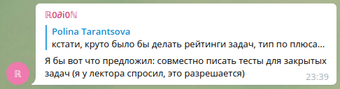

# YSDA-CPP-collective-tests

Коллективно собранные тесты для задач с закрытыми тестами из курса C++.

## Структура

Структура этого репозитория соответствует структуре репозитория с домашками - файлы `test.cpp` лежат в папках, названных так же, как задачи.

## Как контрибьютить?

По умолчанию - просто делайте PR. А вообще можно попросить полные права у кого-нибудь у текущих мэйнтейнеров.

Лучше делать отдельную ветку для изменений, коммитить туда, а потом сквишить коммиты в один и мержить. Но можно жить быстро и коммитить прямо в мастер.

## Насколько это легально?

(это я переложил ответственность на другого человека)

Вообще если вы считаете, что пользоваться этими тестами нечестно - не пользуйтесь. Можно, например, коммитить тесты только после того, как уже сдал задачу, а до этого вообще сюда не заглядывать. *Спасение утопающих дело - рук коллектива.*
